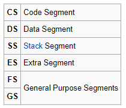

# NOTES
#### Reading the Disk
- OSes usually don't fit into a single (512 bytes) sector, so one of the first things they must do is bootstrap the rest of their code from the disk into memory and then begin executing that code.
- BIOS provides routines that allow us to manipulate data on the drives

#### Extending Memory Access Using Segments
- As we know, initially CPU runs in 16-bit real mode
- The maximum size of registers is 16 bits, which means that the highest **address** we can reference in an instruction is **0xffff** (which amounts to 64 KB i.e 65536 bytes)
- Our example OS won't have the limitation problem, but a day-to-day OS won't fit in such a tight box
- Solution: ***Segmentation***
- To get around the limitation, the CPU designers added few more **special** registers, **cs**, **ds** (*data segment*), **ss** (*stack segment*), and **es**, called *segment* registers.

  
- As you can see from all examples, often the segment register being used is not contained in the instruction, but there is one being used. EVERY time you form an address on an x86 processor there will be a segment register involved.

#### Processor Modes
[Processor Modes](./processor-modes.docx)
